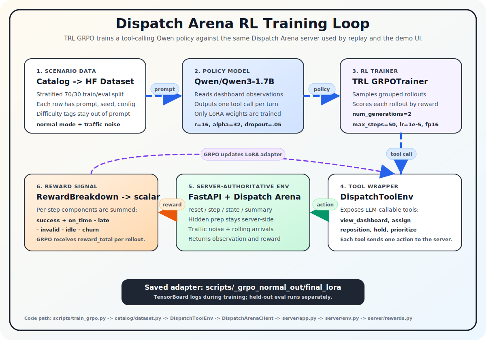

# Dispatch Arena: Building an RL Environment for Delivery Dispatch

> How a simple food-delivery toy problem turned into a dispatch simulator for training, replay, and visual agent demos.

## The Problem I Accidentally Found

I started with a simple idea: can an agent learn to deliver an order?

At first, the world was tiny. One courier. One restaurant. One customer. The agent only had to decide when to wait, when to pick up, and when to drop off.

But after a few runs, the problem felt too clean. Real dispatch is not just about moving from pickup to dropoff. It is about uncertainty: restaurants are late, couriers sit idle, deadlines get tight, and small bad decisions compound over time.

That is where the project changed.

## The First Version: Too Easy To Be Interesting

The initial environment was useful as a proof of concept.

It had:

- one courier
- one order
- one pickup node
- one dropoff node
- fixed actions
- a basic reward for successful delivery

This helped me validate the simulator loop, but it did not create much learning pressure. A hard-coded policy could solve it easily.

The agent was not really learning dispatch. It was learning a tiny script.

## Turning It Into Dispatch Arena

During the hackathon, I rebuilt the project into **Dispatch Arena**.

The goal became:

- keep a small mode for fast training
- add a larger mode for better storytelling
- expose everything through one server
- support replay and frontend visualization
- make reward signals explainable
- prepare the environment for GRPO-style policy optimization

Instead of separate code paths for training and demo, the same backend powers:

- OpenEnv-style `/reset`, `/step`, `/state`, `/summary`
- REST API for the frontend
- WebSocket/replay stream
- visual demo UI

The RL training loop uses the same simulator path. TRL's `GRPOTrainer` samples tool-calling rollouts from a Qwen policy, sends each action into the Dispatch Arena server, sums the environment reward over the episode, and updates only a LoRA adapter.

## Mini Mode: The Training Sandbox

Mini mode is intentionally small.

It contains:

- 1 courier
- 1 order
- 3 nodes: `hub`, `pickup`, `dropoff`
- hidden restaurant prep time
- legal action masks
- short episodes

The agent can take these actions:

## Problem Statements Addressed

### Primary: Statement 3.1 — World Modeling / Professional Tasks

Dispatch Arena fits this theme best because the agent is not answering a static prompt. It is operating inside a stateful dispatch world where actions have delayed consequences.

The agent must reason over courier locations, order readiness, deadlines, hidden prep uncertainty, traffic delays, rolling arrivals, and reward trade-offs. Each action changes the simulator state, and the next decision depends on what happened before.

- **Stateful professional workflow:** The agent acts like a dispatch operator assigning couriers, waiting, repositioning, and managing deliveries over time.
- **Causal action effects:** `assign`, `reposition`, `hold`, `pickup`, and `dropoff` change courier/order state, future legal actions, reward, and final success.
- **Hidden information:** Exact restaurant prep time is hidden unless visible-prep mode is enabled, so the agent must act under uncertainty.
- **Multi-step planning:** A good policy must sequence decisions across a full episode, not solve one isolated task.
- **Realistic operational pressure:** Deadlines, idle couriers, invalid actions, late deliveries, traffic noise, and rolling arrivals create dispatch trade-offs.
- **Server-authoritative environment:** The same backend powers training, replay, API, and frontend visualization, so there is no shortcut path for the agent.

### Secondary: Statement 4 — Self-Improvement

Dispatch Arena also partially fits the self-improvement theme because it is designed as a training environment where policies can be evaluated, compared, and improved over scenario curricula.

The current system does not yet generate adversarial challenges automatically, so I would not claim this as the primary theme. But it does support the foundation for policy improvement.

- **Scenario curriculum:** The catalog contains easy, medium, and hard dispatch scenarios with different skill focuses such as prep uncertainty, rolling arrivals, traffic noise, and courier load balance.
- **Measurable improvement:** Evaluation tracks reward, success rate, on-time rate, invalid rate, lateness, and delivery speed.
- **Reward decomposition:** The environment explains why the policy improves or fails through separate reward components.
- **Baseline comparison:** A heuristic baseline can be evaluated against held-out scenarios, giving a floor for future trained policies.
- **Training loop support:** GRPO smoke training is wired for mini mode, showing the environment can be used for policy optimization.
- **Failure-driven iteration:** Early LLM runs exposed tool-calling failures, which directly informed improvements to prompting, action design, and evaluation.

### Why Statement 4 Is Secondary, Not Primary

The project is not yet fully self-improving because the curriculum is mostly predefined. It does not yet automatically generate new scenarios based on the agent’s weaknesses, nor does it escalate difficulty after mastery.

To make Statement 4 stronger, the next step would be:

- track per-skill weakness metrics
- generate new scenarios targeting those weaknesses
- promote scenarios from easy to hard as the agent improves
- add adversarial scenario generation
- compare policy checkpoints over time