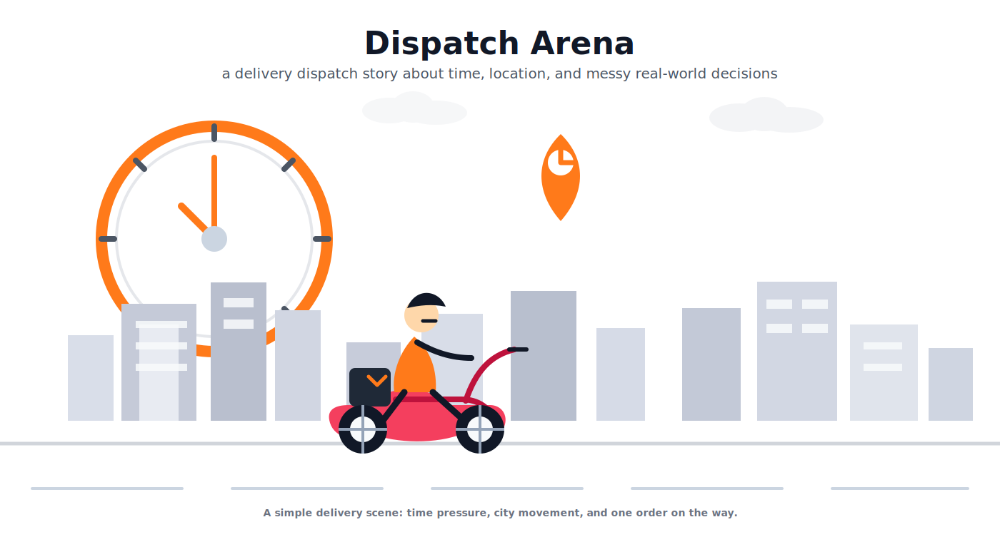
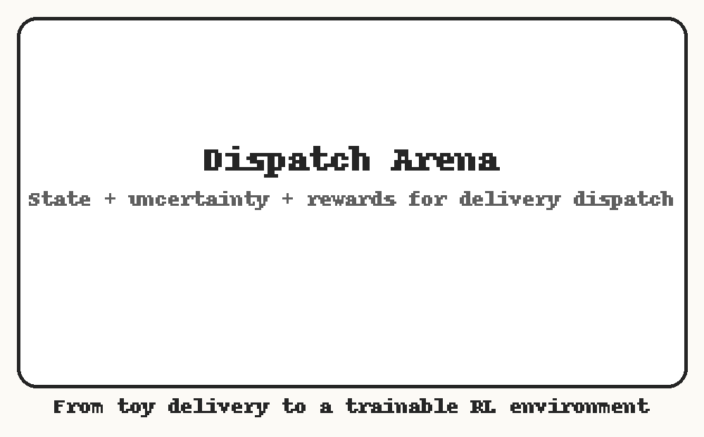
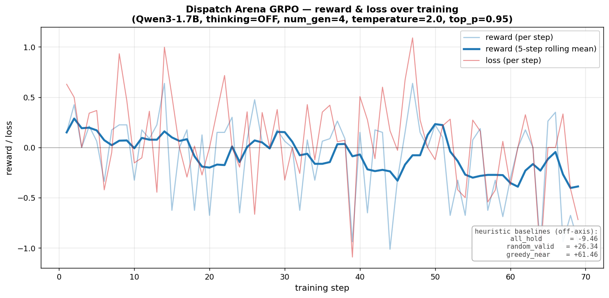
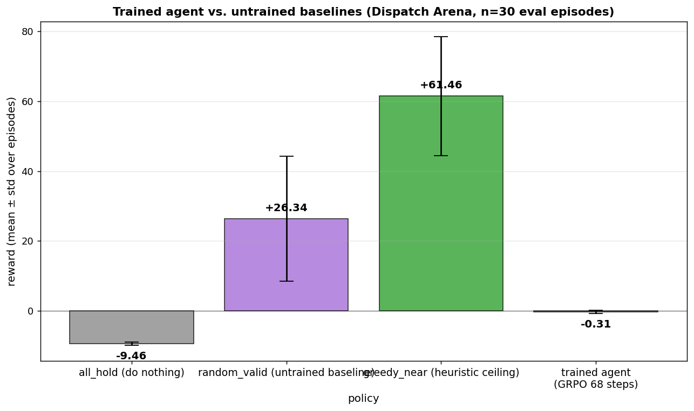

# Dispatch Arena: Training a Delivery Dispatch Agent with OpenEnv and TRL

> How one wrong food-delivery location turned into a simulator for training RL agents on messy dispatch decisions.



## The Problem I Accidentally Found

A few days before the hackathon, I ordered food on Zomato.

Nothing unusual. I was staying with my brother in Bangalore, I picked the saved address, placed the order, and waited. The delivery partner accepted it and started moving. Then he called and said he had arrived.

I went outside. He was not there.

He called again. I could not fully understand what he was saying because of the language gap, so I checked the obvious thing first: did I put the wrong address?

The written address looked correct.

Then he asked me to share my Google Maps location. I sent it. After a few confusing calls, I realized what had happened: he was almost 4-5 kilometers away from my actual location.

That was the small bug that made me think.

In food delivery apps, the courier does not only receive a written address. They also receive a map pin. In practice, the pin often wins. That makes sense most of the time, but when the address and the pin disagree, somebody needs to reason about the mismatch.

A human might ask:

- Is the saved address old?
- Is the map pin wrong?
- Should we ask the customer to verify before dispatching?
- Should the courier start moving or wait for confirmation?

That sounded like an agent problem to me. Not just a chatbot problem, but an agent operating inside a real workflow where every action changes the next state.

My first idea was too broad: can I build an RL agent for food delivery problems?

That was vague. Food delivery includes address correction, restaurant prep, courier routing, batching, support, refunds, ETA prediction, and probably fifty other things I had not even thought about. So I started reading more, and I came across logistics engineering discussions like Swiggy Bytes posts about delivery systems. One recurring theme was dispatch: deciding which courier should serve which order, when, and under what uncertainty.

That became the narrower problem.

Not "solve food delivery."

Train an agent to learn dispatch decisions.

## The Real Dispatch Problem

Today, millions of orders are placed every day across apps like Swiggy and Zomato. Behind each order, some system is making a fast decision:

- which courier should get this order
- whether to assign now or wait for prep
- whether to reposition an idle courier
- whether one courier is getting overloaded
- whether a tight-deadline order should be prioritized

Most dispatch systems are not one magical model thinking end to end. A lot of the real machinery is built from algorithms, heuristics, forecasts, and operational rules.

That is not a criticism. Heuristics are useful. Rules like "send the nearest free courier", "wait if the restaurant looks slow", or "rebalance couriers every few seconds" can work beautifully on quiet shifts.

They break when the shift gets messy.

Restaurants run late. Traffic changes. New orders arrive while older ones are still waiting. One courier gets too many assignments while another sits idle. A decision that looked locally good at tick 3 becomes bad at tick 10.

When these small decisions fail, the cost is not abstract:

- customers get cold food
- couriers wait at restaurants
- deadlines are missed
- refunds happen
- the same mistake repeats in the next shift because the rule did not learn

Multiplied across millions of orders, a tiny dispatch inefficiency becomes a very real business problem.

This is why dispatch is interesting for RL. It is not a single prediction. It is a long-horizon decision problem under partial information.



The animation above is the core idea. The left side is a naive policy: assign immediately, reach the restaurant early, wait, get hit by traffic, and deliver late. The right side is a better dispatch policy: wait or reposition first, assign closer to food readiness, and deliver on time.

The map can look almost the same, but the timing is different. That timing is the dispatch problem.

## What We Added in OpenEnv

The port to OpenEnv keeps the original dispatch simulator idea and adds a cleaner environment interface on top of it. Instead of treating this as a one-off local simulator, I wrapped it as a server-authoritative environment with OpenEnv-style endpoints like `/reset`, `/step`, `/state`, and `/summary`, plus replay-friendly APIs for visualization and debugging. That makes the same environment usable for manual demos, scripted evaluation, and RL training.

I also split the environment into two levels of difficulty. **Mini mode** is the smallest dispatch sandbox: one courier, one order, one pickup, one dropoff, and hidden prep uncertainty. It is useful for smoke tests, reward debugging, and curriculum learning. **Normal mode** expands the same simulator into a more realistic dispatcher setting with multiple couriers, multiple active orders, deadlines, prep uncertainty, traffic effects, and centralized dispatch decisions.

Another important addition is the move from low-level movement control to semantic tool use. In normal mode, the agent behaves like a dispatcher instead of manually moving every courier one step at a time. It can choose actions like `assign`, `reposition`, `hold`, `prioritize`, `view_dashboard`, and `finish_shift`. This makes the environment much more natural for LLM-based agents, because the model is learning a workflow of decisions rather than memorizing raw action IDs.

Finally, I added components that make the environment easier to train and easier to show. Each step returns a decomposed reward instead of only a single final score, so training can track progress, invalid actions, idle penalties, fairness costs, and delivery success separately. On top of that, the environment is packaged for deployment, with a frontend replay UI and Hugging Face Space support, so the same environment can be used both as a research benchmark and as a public interactive demo.

## What Makes This an RL Environment

The important part is that the agent is not answering a static prompt.

It is inside a world.

At every step, it sees a dashboard: courier locations, order statuses, deadlines, travel times, and recent events. Some state is intentionally hidden. For example, exact restaurant prep time is not exposed unless visible-prep mode is enabled.

Then the model chooses a tool call.

The server validates that action, advances time, updates couriers and orders, applies traffic/prep effects, and returns:

- the next observation
- whether the episode is done
- legal actions
- a decomposed reward
- a scalar reward used for training

The reward is not just "good" or "bad". It has components:

- step cost
- progress reward
- invalid action penalty
- success reward
- on-time bonus
- late penalty
- idle courier penalty
- route churn penalty
- fairness penalty

That decomposition matters because it tells us why the policy is improving or failing.

## Training with TRL GRPO

The training setup is inspired by the OpenEnv + TRL pattern from the Hugging Face CARLA article, where a model learns by calling tools inside a simulator and receiving rewards from the environment instead of imitating static labels: [Bringing Autonomous Driving RL to OpenEnv and TRL](https://huggingface.co/blog/sergiopaniego/bringing-carla-to-openenv-trl). In CARLA, the agent learns to brake or change lanes. In Dispatch Arena, the agent learns to act like a dispatcher: read a shift dashboard, choose a tool, observe what happened, and improve from the reward signal.

### What GRPO means for this dispatch problem

For one dispatch scenario, the model does not produce just one trajectory. GRPO samples a **group** of candidate rollouts for the same starting state. Each rollout is a sequence of tool calls over the shift:

\[
\tau_i = (a_1, a_2, \dots, a_T)
\]

Each rollout gets a total reward from the environment:

\[
R(\tau_i) = \sum_{t=1}^{T} r_t
\]

In our case, \(r_t\) already includes the things we care about operationally: progress toward delivery, on-time bonus, invalid-action penalties, idle penalties, late penalties, and fairness costs. GRPO then compares candidates **relative to the rest of the group** on the same scenario. A simple way to think about it is:

\[
A_i \propto R(\tau_i) - \text{average reward of the group}
\]

If one rollout assigns the right courier, waits when prep is hidden, avoids too much idling, and finishes with more on-time deliveries, it gets a higher reward, so the model is nudged toward that behavior. If another rollout keeps holding too long, sends the wrong courier, or accumulates late and idle penalties, it gets a lower reward, so the model is nudged away from it. That is why GRPO fits dispatch well: we often do not know a single correct action for a state, but we can compare better and worse dispatch trajectories after seeing how the shift unfolds.

### How we train Dispatch Arena

The current training run uses `Qwen/Qwen3-1.7B` with PEFT LoRA and TRL's `GRPOTrainer`. The scenario catalog is loaded into a Hugging Face `Dataset` and split into 70 training scenarios and 30 held-out evaluation scenarios. Each dataset row contains a dispatcher system prompt, a kickoff message, a random seed, and a normal-mode environment config. The difficulty labels stay only as metadata; they are not leaked into the model prompt.

Unlike CARLA, which needs multiple GPU-backed Spaces because each simulator instance is heavy, Dispatch Arena is lightweight enough to run against a shared local FastAPI server. The training script starts one server in-process, and TRL creates one `DispatchToolEnv` per generation through `environment_factory=DispatchToolEnv`. Each wrapper talks to the server through `DispatchArenaClient` and exposes six semantic tools to the model: `view_dashboard`, `assign`, `reposition`, `hold`, `prioritize`, and `finish_shift`. So the exact same environment path is used for demos, debugging, and RL training.

The loop is straightforward:

1. sample one scenario row from the catalog
2. create a group of rollouts for that same row
3. let the model read the dashboard and emit one tool call at a time
4. route each tool call through `DispatchToolEnv` into the FastAPI simulator
5. accumulate the environment reward over the whole shift
6. compare grouped rollouts and update only the LoRA adapter

In code, the trainer is wired like this:

```python
trainer = GRPOTrainer(
    model="Qwen/Qwen3-1.7B",
    reward_funcs=[reward_total],
    args=config,
    train_dataset=train_ds,
    environment_factory=DispatchToolEnv,
    peft_config=lora_config,
)
```

The main run is still intentionally small and hackathon-friendly: `num_generations=4`, `max_steps=80`, `max_completion_length=384`, `max_tool_calling_iterations=20`, `learning_rate=1e-5`, `fp16=True`, and LoRA rank `r=16`. The goal is not to claim that dispatch is solved. The goal is to show that the full loop works: scenario -> tool calls -> simulator transitions -> rewards -> GRPO update.



The training curve above is from an early GRPO run. It is noisy, which is expected for online RL on a sequential tool-using environment. The important part is that reward and loss are now tied to real dispatch rollouts rather than offline labels. Once the pipeline is live, the main levers become reward design, rollout scale, and scenario quality.



The baseline comparison is useful because it shows where the project currently stands. The heuristic baseline is still much stronger than the trained policy in this short run, and the trained agent is not yet beating the simple hand-built baselines. That is not a bad result to hide; it is a useful result to measure. It tells us that the environment, reward loop, and GRPO path are wired correctly, and it also tells us exactly what still needs improvement: longer training, better reward shaping, more rollout budget, and a more carefully balanced scenario mix.

## What the Agent Is Learning

The agent is not learning only "nearest courier wins."

It has to learn trade-offs like:

- assigning too early can make a courier wait at the restaurant
- assigning too late can miss the deadline
- holding can be useful, but too much holding wastes time
- repositioning can help if future demand is predictable
- one courier should not get every order while others idle
- traffic noise can turn a safe-looking route into a late delivery

This is why RL fits better than a one-step classifier. The quality of an action depends on what it causes later.

For example, assigning the nearest courier may look correct now. But if the food is not ready and another order will appear near that courier two ticks later, the locally obvious decision may be globally worse.

That is the kind of mistake I wanted Dispatch Arena to expose.

## What Is Done

The current project already has:

- OpenEnv-compatible `/reset`, `/step`, `/state`, `/summary`
- mini and normal modes
- hidden prep time
- traffic noise
- rolling order arrivals
- action masks and legal actions
- decomposed rewards
- replay storage
- WebSocket/demo UI support
- GRPO smoke training
- catalog-driven normal-mode training
- held-out evaluation scripts

The trainer saves the final LoRA adapter to:

```text
dispatch_arena/scripts/_grpo_normal_out/final_lora
```

## What Is Still Missing

There are still many real delivery problems that Dispatch Arena does not model yet:

- address/pin mismatch verification
- restaurant open/close windows
- restaurant going offline temporarily
- order bundling
- customer messaging
- stockouts and substitutions
- richer courier behavior
- adversarial scenario generation

The address mismatch story is what started this project, but the current environment focuses on dispatch because it is a clean RL problem to build first.

That is probably the right scope for now.

## Why This Matters

Dispatch is one of those problems that looks simple from outside.

Food has to go from restaurant to customer. Send a courier. Done.

But inside the system, every decision is made with incomplete information. Restaurant prep is hidden. Traffic changes. Orders arrive later. Couriers are not interchangeable. A bad action can look harmless for a few ticks and only show its cost near the deadline.

That is exactly the kind of workflow where an agent should not just follow a fixed rule. It should learn from scenarios, fail safely in simulation, and improve before touching the real world.

Dispatch Arena is my attempt to make that learning loop small enough to run, inspect, replay, and explain.

## Try It Locally

Install the package:

```bash
uv venv --python 3.11 .venv
uv pip install --python .venv/bin/python -e ./dispatch_arena
```

Run the server:

```bash
.venv/bin/python -m dispatch_arena.server.app
```

Run the tests:

```bash
.venv/bin/python -m unittest discover -s dispatch_arena/tests
```

Run one demo episode:

```bash
.venv/bin/python -m dispatch_arena.scripts.demo_client_episode
```

Run the normal-mode GRPO training script on a GPU:

```bash
.venv/bin/python -m dispatch_arena.scripts.train_grpo
```

## Resources

- Reference article: [Bringing Autonomous Driving RL to OpenEnv and TRL](https://huggingface.co/blog/sergiopaniego/bringing-carla-to-openenv-trl)
- TODO: add the exact Swiggy Bytes logistics/dispatch article link here.
- Main training script: `dispatch_arena/scripts/train_grpo.py`
- Environment core: `dispatch_arena/server/env.py`
- Reward model: `dispatch_arena/server/rewards.py`
- Scenario catalog: `dispatch_arena/catalog/catalog.json`
